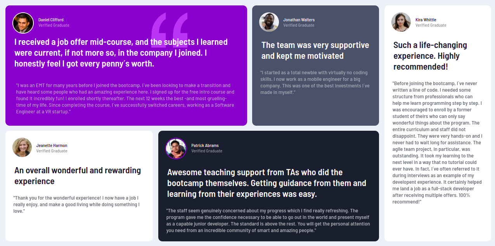

# Testimonial Grid Section



# Como executar

Clone o projeto em seu dispositivo e acesse a pasta do mesmo

```
$ git clone

```

# Projeto

Testimonial Grid Section é um desafio da plataforma FrontendMentor, que tem o objetivo de treinar os conceitos de HTML, CSS e o pré processador Sass.

# Autor

Lara Fernanda

# Licença

Este projeto está sob a licença MIT - Veja